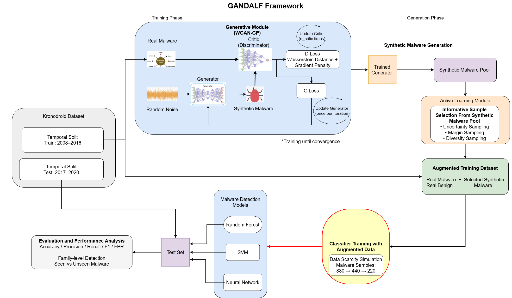

# GANDALF
GANDALF: GAN-Driven Active Learning Framework for Android Malware Detection.

This repository contains the research code and experimental components developed for the GANDALF framework proposed for Android malware detection under data scarcity conditions.

The study combines:
- WGAN-GP based synthetic malware generation,
- Conditional GAN (cGAN) based family-aware synthetic malware generation,
- Active Learning based sample selection,
- temporal malware evaluation,
- and malware family-level analysis.

The experiments were conducted using the publicly available KronoDroid dataset.

#Framework Overview

The proposed approach integrates:
- synthetic malware generation,
- selective synthetic sample filtering,
- and temporal evaluation methodology.

#Repository Contents

The repository includes:
- preprocessing scripts,
- augmentation modules,
- Active Learning components,
- evaluation scripts,
- and visualization utilities

used during the experiments.

# Dataset

This work uses the publicly available KronoDroid dataset:

Please download the dataset from the original source and follow the corresponding license and usage terms.

The dataset itself is not redistributed in this repository.

# Data Preprocessing

Several preprocessing operations were applied before training and evaluation, including:
- feature separation,
- feature pruning,
- missing value handling,
- malware/benign dataset merging,
- and feature scaling.

The repository contains the preprocessing scripts used during the study.

# Repository Structure

GANDALF/
│
├── README.md
├── requirements.txt
│
├── figures/
│
└── src/
    ├── preprocessing/
    ├── augmentation/
    ├── active_learning/
    ├── evaluation/
    └── visualization/

# Notes

This repository is primarily intended for research and academic purposes.

Some scripts were originally developed as part of experimental research workflows and may require additional configuration depending on the dataset organization and runtime environment.

# Citation

If you use this repository, please cite:

bibtex
@article{gandalf2026,
  title={GANDALF: GAN-Driven Active Learning Framework for Android Malware Detection},
  author={Coban, Tufan and Sen, Sevil},
  journal={Under Review},
  year={2026}
}

# License

MIT License

